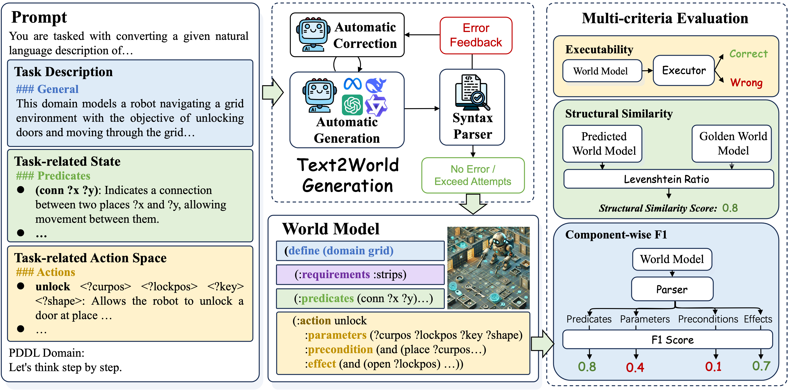

<h1 align="center">
	🌍 Text2World: Benchmarking World Modeling Capabilities of Large Language Models via Program Synthesis<br>
</h1>

# 📚 Overview


# 💻 Installation
```
conda create -n text2world python=3.8 -y
conda activate text2world

pip install -r requirements.txt
```

# 🏃 Generate PDDL
Running the following command will generate files with `PROMPT_TYPE="desc2domain_zeroshot_cot"` and `DESCRIPTION_TYPE="corrected_description"` in the `_generated_pddl/_all_gen` directory.  
```
bash generate.sh ${MODEL} ${CORRECTION_TIME}
```
To try different values for `$PROMPT_TYPE` and `$DESCRIPTION_TYPE`, you can manually modify them in the `generate.sh` script.

## Complete `utils/.env` file
```
OPENAI_API_TYPE="open_ai"
OPENAI_API_BASE=...
OPENAI_API_KEY=...
```

## Available `$MODEL`
```
claude-3.5-sonnet
CodeLlama-34b-Instruct-hf
deepseek-reasoner
deepseek-v3
msal-gpt-3.5
gpt-3.5-turbo-0125
gpt-3.5-turbo-1106
gpt-4o
gpt-4o-mini
gpt-4-turbo
Mixtral-8x22B-Instruct-v0.1
Meta-Llama-3.1-70B-Instruct-Turbo
Meta-Llama-3.1-405B-Instruct-Turbo
o1-mini
o1-preview
o3-mini
```

## Define your own `$MODEL`
If you need to configure your own LLM, you can modify `utils/text2world.yaml` to define your custom model, as an example:
```
${NAME}:
    name: gpt # API type
    engine: ${ENGINE}
    context_length: 128000
    use_azure: False
    temperature: 0.
    top_p: 1
    retry_delays: 20
    max_retry_iters: 100
    stop: 
    max_tokens: 4000
    use_parser: False
```

# 🧑‍🏫 Evaluate Generated PDDL
First, create a project using the following command. It will create a folder with the same name under `_generated_pddl`. Note that `$PROJECT_NAME` cannot be `_all_gen`.
```
bash create_project.sh $PROJECT_NAME
```
Next, please manually copy the generated content of the models you are interested in evaluating from `_generated_pddl/_all_gen` to `_generated_pddl/$PROJECT_NAME`.

Finally, run the following command to evaluate all models in the project. The evaluation results will be generated in `_generated_pddl/_eval_result/$PROJECT_NAME`, including detailed scores for all PDDL files generated by each model and an overall leaderboard in the `_result_board.txt` file.
```
bash evaluate.sh $PROJECT_NAME
```
